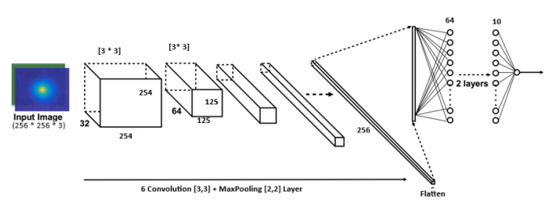
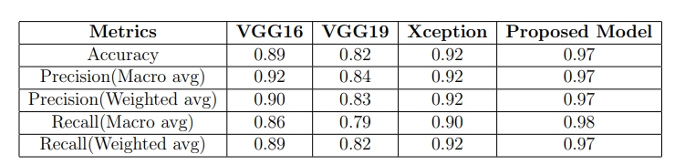

# TomatoDiseaseDetection
## TOMATO LEAF DISEASE DETECTION USING DEEPLEARNING

**Submitted in partial fulfillment of the requirements for the degree BACHELOR OF COMPUTER ENGINEERING**

**Submitted by:**
>Amit Duwal   [Contact](https://www.linkedin.com/in/amit-duwal-696310200/)

>Anish Machamasi

>Bimal Bhoyadyo

### Dataset: [PlantVillage](https://www.kaggle.com/datasets/emmarex/plantdisease)

Compares VGG16, VGG19, XCEPTION and a new model for classification of leaf diseases in tomato leaves. All the models are based on CNN and constructed with tensorflow.

### Architecture of new model

### Result
